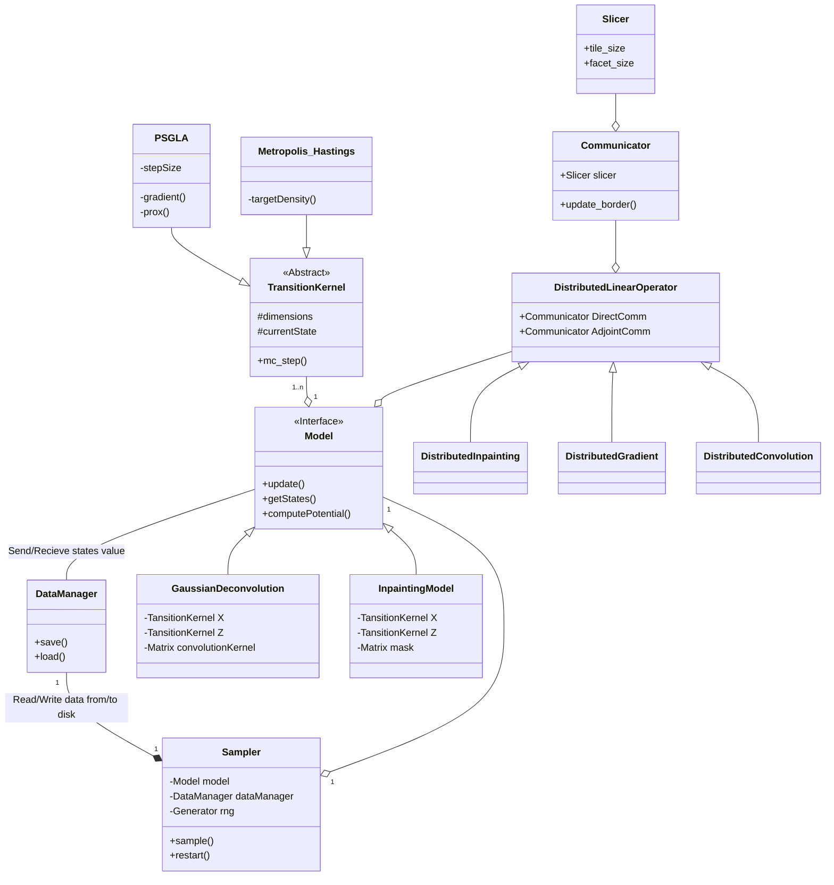

```
UML diagram
```

______________________________________________________________________


```mermaid
classDiagram
    class TransitionKernel{
        <<Abstract>>
        #dimensions
        #currentState
        +mc_step()
    }

    class PSGLA{
    -stepSize
    -gradient()
    -prox()
    }
    class Metropolis_Hastings{
    -targetDensity()
    }

    class Communicator{
    +Slicer slicer
    +update_border()
    }

    class DistributedLinearOperator{
    +Communicator DirectComm
    +Communicator AdjointComm
    }

    class DistributedConvolution{
    }

    class Slicer{
    +tile_size
    +facet_size
    }

    class Model{
        <<Interface>>
        +update()
        +getStates()
        +computePotential()
    }


    class InpaintingModel{
        -TansitionKernel X
        -TansitionKernel Z
        -Matrix mask
    }
    class GaussianDeconvolution{
    -TansitionKernel X
    -TansitionKernel Z
    -Matrix convolutionKernel
    }


    class Sampler{
        -Model model
        -DataManager dataManager
        -Generator rng
        +sample()
        +restart()
    }

    class DataManager{
        +save()
        +load()
    }

    PSGLA --|> TransitionKernel
    Metropolis_Hastings --|> TransitionKernel

    Model "1" --o "1" Sampler
    Model <|-- InpaintingModel
    Model <|-- GaussianDeconvolution

    Slicer --o Communicator
    Communicator --o DistributedLinearOperator


    DistributedLinearOperator <| -- DistributedConvolution
    DistributedLinearOperator <| -- DistributedGradient
    DistributedLinearOperator <| -- DistributedInpainting

    DistributedLinearOperator --o Model


    TransitionKernel "1..n" --o "1" Model

    DataManager "1" --* "1" Sampler : Read/Write data from/to disk
    Model -- DataManager : Send/Recieve states value

```
