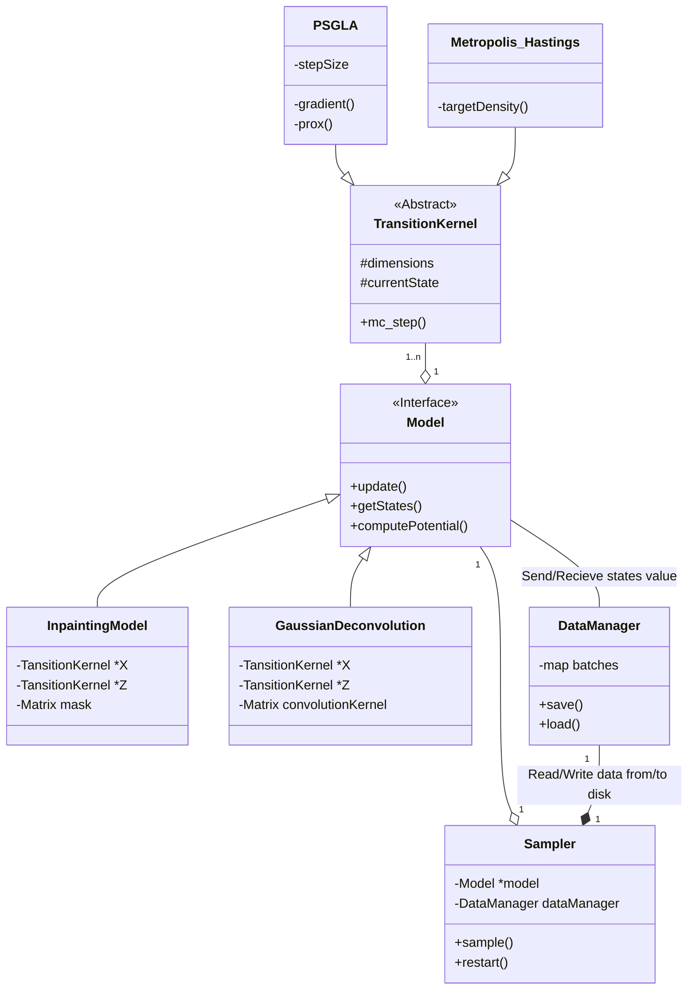

______________________________________________________________________

```
UML diagram
```

______________________________________________________________________


```mermaid
classDiagram
    class TransitionKernel{
        <<Abstract>>
        #dimensions
        #currentState
        +mc_step()
    }

    class PSGLA{
    -stepSize
    -gradient()
    -prox()
    }
    class Metropolis_Hastings{
    -targetDensity()
    }


    class Model{
        <<Interface>>
        +update()
        +getStates()
        +computePotential()
    }


    class InpaintingModel{
        -TansitionKernel *X
        -TansitionKernel *Z
        -Matrix mask
    }
    class GaussianDeconvolution{
    -TansitionKernel *X
    -TansitionKernel *Z
    -Matrix convolutionKernel
    }


    class Sampler{
        -Model *model
        -DataManager dataManager
        +sample()
        +restart()
    }

    class DataManager{
        -map batches
        +save()
        +load()
    }

    PSGLA --|> TransitionKernel
    Metropolis_Hastings --|> TransitionKernel

    Model "1" --o "1" Sampler
    Model <|-- InpaintingModel
    Model <|-- GaussianDeconvolution


    TransitionKernel "1..n" --o "1" Model

    DataManager "1" --* "1" Sampler : Read/Write data from/to disk
    Model -- DataManager : Send/Recieve states value

```
